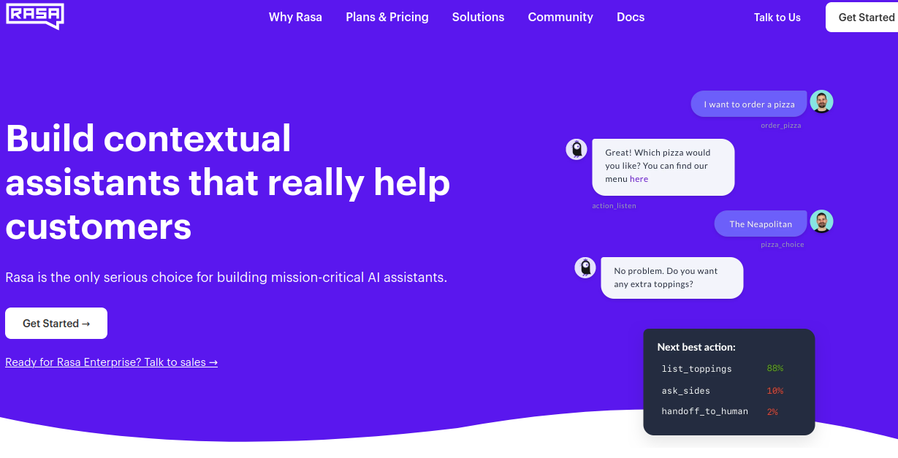
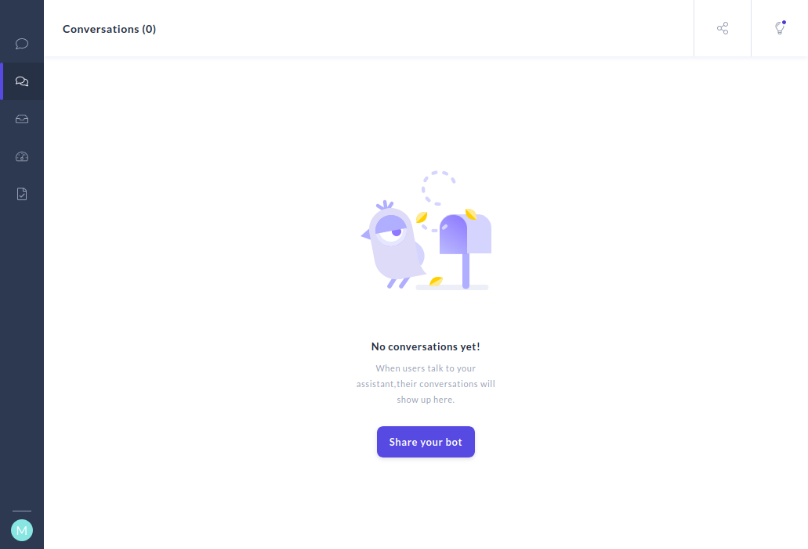
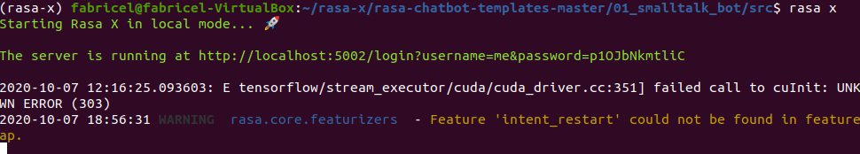
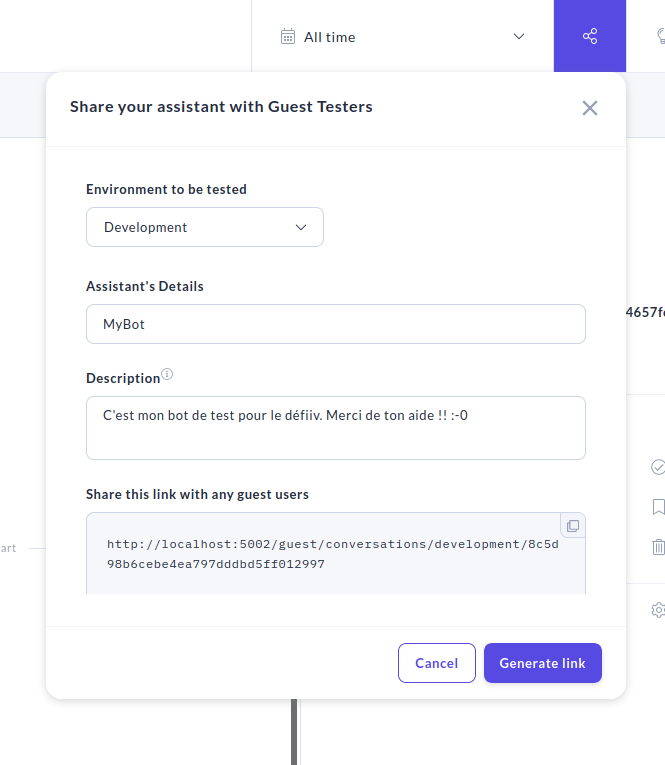

# defiiv
# Atelier pour le Défi Interactions Vocales


Ce défi constitue une introduction au monde des interactions vocales humain-machine. Ce domaine complexe suppose d'enchaîner de nombreux traitements automatiques afin de reproduire (du moins en apparence) les capacités de communication des humains. Quelques heures sont donc une goutte d'eau pour appréhender ce vaste champ de recherche et de développement. Malgré tout le recours à un outil complet facilement opérationnel doit permettre de se donner un aperçu haut-niveau des enjeux de la mise en oeuvre d'une plateforme conversationnelle.

Nous retiendrons la solution open-source [RASA](https://rasa.com) pour le défi.

## Presentation de RASA

RASA c'est RASA qui en parle le mieux : 

[](https://rasa.com)

La [documentation](https://rasa.com/docs/) est assez complète, et très pédagogique. Elle sera à découvrir au fur et à mesure du déroulement du défi.

> **Attention :** à la gestion du temps, on peut vite passer beaucoup de temps à la lecture de la doc. Il faut bien cibler ses besoins et se limiter à ce qui est nécessaire à la réalisation du défi. L'application sera ensuite une occasion d'aller plus avant dans les concepts de la plateforme.

On distinguera notamment bien les nuances entre :
- RASA Open Source, la base de la distribution qui comprend tous les composants pour développer un chatbot
- RASA Action Server, SDK permettant de définir ses propres actions (en python par exemple), appelées par le chatbot
- RASA-X, plateforme web offrant des outils pour assurer la mise au point d'un chatbot RASA
	- Intègre sa propre version de RASA Open Source et RASA Action Server

> **Attention :** RASA-X vient de passer RASA Enterprise (et donc payant). RASA-X est toujours accessible sur [https://legacy-docs-rasa-x.rasa.com/docs/rasa-x/](https://legacy-docs-rasa-x.rasa.com/docs/rasa-x/)

> **Attention :** la dernière version de RASA Open Source est 3.0.x alors que la version utilisée avec RASA-X est toujours 1.x. Penser à lire la bonne documentation (il y a des changements non négligeables entre les 2 version) en réglant le sélecteur en bas à gauche ou en allant directement sur [https://legacy-docs-v1.rasa.com/](https://legacy-docs-v1.rasa.com/).

> **Attention :** bien qu'intégré dans RASA-X, le serveur d'actions doit être explicitement démarré pour fonctionner avec RASA-X (cf ci-dessous).

Avant l'installation il est possible de découvrir RASA sur le site au travers d'[une page playground](https://rasa.com/docs/rasa/playground) permettant de déveloper très rapidement un chatbot élémentaire. 

## Installation locale de RASA-X

RASA-X est pré-installé sur les machines de TP, afin de nous faire gagner du temps et éviter de surcharger les profils itinérants :
```bash
  mkdir ~/monProjetRasax
  source /usr/local/stow/rasax/bin/activate
```
> **Attention :** sur les machines de TP en salle, il faut bien créer le dossier du projet dans votre répertoire de montage. Rasa X a du mal avec les autres disques montés en réseau.

Toutefois une procédure d'[installation locale simple](https://rasa.com/docs/rasa-x/installation-and-setup/install/local-mode) est disponible sur le site de RASA. On notera ensuite dans la documentation que les moyens d'élargir facilement le fonctionnement de l'outil sur des serveurs dans le cloud sont prévus.

> **Attention :** ne pas faire d'installation sur une machine perso durant l'atelier. Cela prend trop de temps et vous éloigne du sujet. Il sera tout à fait possible de le faire ensuite, notamment pour ceux voulant poursuivre le défi en faisant l'application !
  
## Initialisation et lancement RASA-X

Pour initier un premier bot RASA simple, la commande suivante suffit :
```bash
rasa init
```
Ensuite un certain nombre de fichiers YAML sont créés permettant de configurer son bot :
```bash
data/nlu.md
data/stories.md
config.yml
domain.yml
endpoints.yml
actions.py
```
Le rôle de chacun de ces fichiers est clairement précisé dans la documentation et sera explicité plus tard.

Une fois un bot minimal créé il est possible de lancer RASA-X :
```bash
rasa x
```
Si tout va bien (lire les infos sur le terminal pour le vérifier), une page web devrait s'ouvrir pointant sur la page d'accueil :



[//]: # (> Attention : votre page n'aura pas de conversations au démarrage. L'affichage précédent)

> **Attention :** le login se fait automatiquement au démarrage. En cas de besoin ultérieur, les identifiants générés automatiquement se retrouvent sour la commande rasa. Par exemple, 4ème ligne de l'image ci-dessous.
> Si besoin, voir la documentation pour définir votre propre mot de passe.



Lors de cette première ouverture, les fichiers présents dans le répertoire sont utilisés pour initier le chatbot. La première étape va être d'entraîner un premier modèle, même sans faire de modifications ou d'ajouts. Le bouton "Train" permet ca.

> **Attention :** l'entraînement implique la création d'un modèle (en réalité il peut même être composé de plusieurs (sous-)modèles : pour les intents, les stories...). Ensuite il faudra indiquer comme "Actif" ce modèle pour qu'il soit utilisé par le chatbot lors des interactions de test.

> **Attention (suite) :** après chaque itératon d'entraînement un nouveau modèle est créé et doit être rendu "Actif", sinon on reste sur le précédent !

## Tâche : consultation d'un EdT

La tâche que nous allons traiter est une des parties prévues pour le bot complet qui sera réalisé dans la partie application : **la consultation d'un emploi du temps**.

Pour information dans la partie application un robot d'accueil complet sera dévelopé. Parmi les fonctions possibles sont prévues :
- consultation d'emploi du temps étudiant
	- connexion à l'API Partage ou BD
	- requête par formation/groupe/enseignant/salle
	- retourne les cours suivant dans la 1/2 journée entamée avec affichage
- consultation occupation salles libre-service
	- connexion à l'API Partage ou BD
	- requête optionnelle par date/heure
	- retourne une salle sans cours affectée pour la date/heure demandée sinon maintenant
- orientation batiment
	- connexion à BD : liste des salles avec descriptif
	- requête par salle
	- retourne la route depuis le hall de la salle avec affichaghe du plan correspondant
- texte prof
	- connexion à BD : liste des enseignants avec contacts
	- requête par nom/cours
	- retourne confirmation envoi d'un sms avec le message dicté
- socialisation
	- état mental ("Comment allez-vous ?")
	- consultation météo
	- blagues

Il s'agira donc de compléter le chabot initié durant cet atelier puis de le connecter à un robot Pepper pour pouvoir ensuite le tester et finalement utliser des réseaux de neurones pour optimiser son comportement automatiquement. Mais on en reparle plus tard, pour l'instant il faut lancer la version de base du bot...

## Développement du bot 0.1

Dans la première version du bot, l'utilisateur pourra accéder à son emploi du temps en indiquant uniquement la formation et le groupe recherchés. 

Pour l'instant l'action de finalisation de la tâche se limitera à afficher les informations recoltées jusque là dans le dialogue, puis à enchaîner sur une nouvelle reqête ou les salutations finales. L'interaction avec une BD sera étudiée plus tard dans l'atelier.

Pour cette première version du bot, les définitions seront mises directement dans les fichiers. Bien sur le recours a RASA-X directement est possible, mais cela permet de mieux comprendre les choses dans un premier temps.

Voici les fichiers à modifier :
- `data/nlu.md`
- `data/stories.md`
- `domain.yml`
- `endpoints.yml` 
- `actions.py`

Des exemples de chatbot sont donnés dans le répertoire [examples]. Ils sont testables facilement et rapidement avec ```rasa shell``` et leurs fichiers permettent de découvrir plusieurs type d'organisation de chatbot, en fonction de la tâche visée.

> **Aide :** les fichiers dans [emploi_du_temps](emploi_du_temps/nlu.md) (nlu.md, stories.md, actions.py, domain.yml, endpoints.yml) intégrent les définitions permettant au chatbot de gérer des demandes portant sur un emploi du temps. Pour l'instant l'action retourne toujours la même réponse (elle sera complétée avec l'accès en DB, ci-après). Tous les fichiers doivent être rapatriés. Et `nlu.md`et `stories.md` doivent être copiés dans le répertoire `data`. Ensuite, avant de relancer rasa-x, il faut lancer un apprentissage puis démarrer le serveur d'actions :
> ```bash
> rasa train
> rasa run actions &
> rasa x
> ```

## Développement du bot 0.2

On peut afficher une 'compilation' des stories en les sélectionnant (Ctrl) puis en cliquant sur `Compare multiple stories` (icône apparaissant sur la même ligne que le nom de la story). Une fenêtre "Compare" apparaît donnant le graphe de toutes les options décrites dans les stories sélectionnées. Le même résultat sur l'ensemble des stories existantes peut être obtenu par :
```bash
rasa visualize
```

A partir de la version initiale 0.1 il s'agit maintenant d'augmenter la qualité du bot. Pour cela on peut affiner l'écriture des éléments faite au 0.1 mais il est bien plus simple de procéder directement en utilisant le bot. Ainsi vous pouvez :
1. Vérifier le comportement attendu du bot : s'assurer que les intents et stories prévus fonctionnent comme attendu
2. Ajouter des variantes à l'aide de l'interface : utiliser les fonctions d'annotations en ligne permettant de corriger les prédictions du modèle actuel pour lui permettre de distinguer de nouveaux cas
3. Ré-entraîner le modèle
4. Retour au 1

## Développement du bot 0.3 (optionnel)

La version prédécente étant stabilisée le bot est augmenté pour pouvoir tenir compte de la date et l'heure dans la demande de l'utilisateur.

## Développement du bot 0.4

La version prédécente étant stabilisée on va pouvoir ajouter quelques interactions plus sociales en plus de la tâche de fond. 

Par exemple, après une invite à l'utilisateur sur son état d'esprit ("Comment ca va aujourd'hui ?"), on va prévoir que si ce dernier affiche une situation négative le bot va lui afficher une photo 'oh trop mignon' (un petit chat,...) avec le commentaire 'Désolé d'entendre ça, j'espére que cette image va vous remonter le moral").

Le bot pourrait aussi proposer une blague ou une info intéressante...

## Développement du bot 1.0

Une fois la mise au point 'interne' jugée suffisante (d'ailleurs selon quels critères ?), il est possible de faire tester son bot par d'autres utilisateurs. En allant dans la page "Conversations", il est possible de générer un lien à partir de l'icone "Share" qui ouvre le menu suivant :



L'adresse communiquée permettra à vos collègues d'accéder à votre bot pour le tester et il sera possible de tracer les conversations faîtes par ces derniers pour les contrôler/annoter ensuite avant de les prendre en compte dans un nouvel apprentissage.

> **Attention :** le lien fourni peut être basé sur l'adresse locale de votre machine (localhost). Il faut la remplacer par sa vraie IP (à récuperer dans la configuration réseau).

## Développement du bot 1.etc

Une fois le bot stabilisé dans un bon fonctionnement, deux options sont proposées pour la poursuite de l'atelier :
- la connexion à une base de données
- l'ajout d'une interface pour entrées vocales

### Option :floppy_disk: : connexion base de données

Pour cette option il va s'agir de permettre au bot de rechercher les informations voulues par l'utilisateur dans une base de données. Pour cela n'importe quelle gestionnaire de base de données disposant d'une librairie python fera l'affaire. Par exemple SQLite3, MangoDB...

Un chatbot illustrant cette capacité est donné dans le répertoire [connexion_db](connexion_db). 

Les opérations sont :
 1. Installation du gestionnaire de base de données souhaité en local (```pip3 install sqlite3```)
 2. Création d'une base dédiée au bot, avec identifiants (ou pas)
 3. Edition de `actions.py` pour adapter l'action de finalisation, en intégrant les opérations de la base de données (par exemple comme dans l'exemple dans [travel_agency_bot](connexion_db/travel_agency_bot), mais voir aussi l'aide ci-dessous)
 
Une version plus intégrée à RASA de connexion BD existe depuis peu : les Knowledge Bases. Un tutorial est disponible sur [https://github.com/RasaHQ/tutorial-knowledge-base](https://github.com/RasaHQ/tutorial-knowledge-base). Cela permet en définitive les mêmes capcités que l'accès par les `actions` mais en simpifiant la manipulation des slots lors du dialogue. Toutefois l'approche est récente et proposée actuellement en test dans RASA, laisson-lui le temps de faire ses preuves !

> **Aide :** dans `connexion_db` le fichier [db_sqlite.py](connexion_db/db_sqlite.py) donne un exemple de fichier permettant de créer une DB, d'instancier quelques enregistrements d'exemples puis de fournir la fonction d'accés depuis le fichier [actions.py](connexion_db/actions.py). Les deux fichiers doivent être rapatriés dans le répertoire principal du chatbot, puis db_sqlite.py exécuté. Ensuite, avant de relancer rasa-x, il faut re-démarrer le serveur d'actions :
> ```bash
> rasa run actions &
> ```

### Option :speaker: : entrées vocales avec UI

Si les échanges de texte sont déjà une fonctionalité avantageuse pour les humains, ils ne sont toujours pas représentatifs du mode principal de communication entre humains : la parole. Aussi nous nous proposons à partir du bot actuel d'ajouter une interface permettant aux utilisateurs de lui parler. 

Bien sur les enjeux liés au développement d'une telle technologie, éminement complexe, sont encore très importants. Toutefois des solutions "clés en main" existent déjà permettant d'éviter toute la difficulté pratique à son déploiement. Ainsi Google offre des accès gratuits à sa solution STT (Speech-to-Text) sur le Cloud (moyennant une limitation mensuel des appels à l'API) ou directement au travers de son navigateur Chrome (sans limitation).

Install Chrome ici :point_right: [](https://doc.ubuntu-fr.org/google_chrome) ou intaller Chromium à partir de "Ubuntu Software" (la valise dans le menu de gauche)

Nous utiliserons cette dernière solution ici afin de développer conjointement l'interface vocale et son GUI dans le contexte bien maîtrisé d'HTML/JS. Un exemple de page utilisant la Web Speech API de Google est donné dans le répertoire [entrees_vocales](entrees_vocales), complété par un affichage type "chatbot" `chatroom`. Pour l'utiliser, il faut seulement ajuster la ligne 15 qui indique l'url du serveur RASA visé dans votre cas (indiquée après le lancement du serveur en ligne de commande).

Dans le cadre de l'application le même principe sera utlisé pour connecter un robot Pepper à votre bot en passant d'abord par l'API Google Cloud pour obtenir la transcription des entrées vocales de l'utlisateur. Il sera alors possible de converser avec le robot et de collecter les dialogues réalisés pour ensuite procéder à une analyse des données. L'objectif sera lors d'obtenir une stratégie de dialogue optimale l'aide d'un algorithme d'apprentissage par renforcement (par exemple un DQN, Deep Q-Network, basé sur des réseaux de neurones profonds), implémenté avec la librairie TensorFlow/Keras. Mais ca c'est une autre histoire...


> Last update: en cas de passage en distanciel durant le semestre, le problème sera l'accès aux robots et donc l'application pourra bien sur être développée seulement sous forme d'interface graphique (type UI Web). Mais il sera demandé que les séances d'application aient le status de TP spécifique et que nous soyons autorisés à les faire en présentiel.

&copy; Fabrice Lefèvre, 2022
